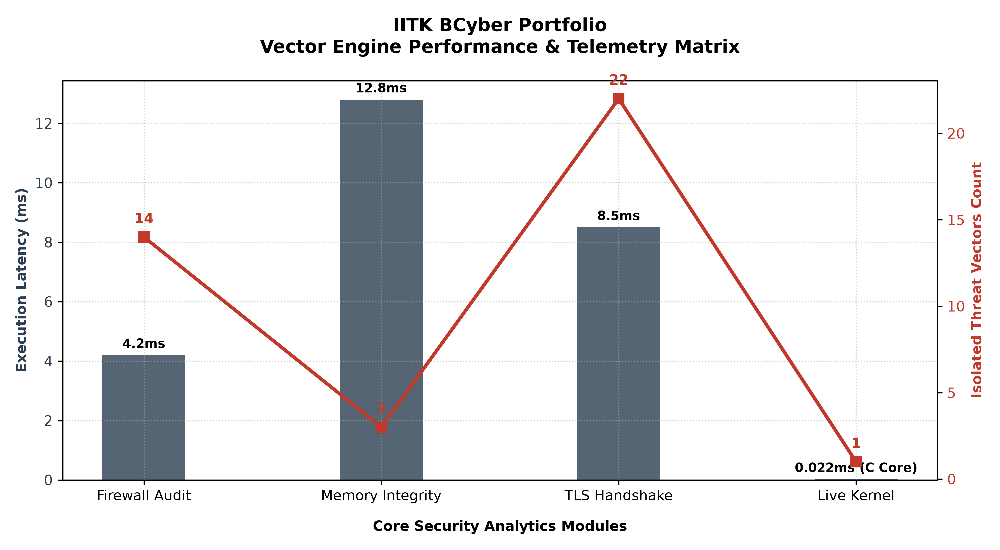

# Quantitative Security Analytics Engine


## 🚀 Quickstart & Reproduction Guide

To deploy and execute the validation benchmarking suite locally, initialize your shell environment using the following pipeline:

```powershell
# 1. Clone the core security architecture
git clone https://github.com/shubhangithakur07/iitk-bcyber-portfolio
cd quantiative_engine

# 2. Initialize and activate isolated virtual environment
python -m venv venv
.\venv\Scripts\Activate.ps1

# 3. Ingest deterministic dependencies
pip install -r requirements.txt

# 4. Execute the mathematical unit-testing verification suite
python -m unittest P_test_vector_engine.py

# 5. Run the high-density performance matrix profiler
python P_performance_profiler.py

A high-performance, vectorized SIEM (Security Information and Event Management) analytics engine designed to intercept low-level operating system telemetry and perform loop-free threat isolation using NumPy matrix masking.

## 🚀 Active Production Components

### Core Analytics & Threat Detection
* **`(P)live_system_audit.py`**: Live Windows kernel ingestion and vector threat scanning pipeline.
* **`(P)firewall_audit.py`**: Vectorized network firewall packet filtering.
* **`(P)memory_integrity_detector.py`**: Real-time memory page allocation and W^X vulnerability scanning.
* **`(P)tls_handshake_anomaly_detector.py`**: Edge-case TLS data exfiltration ratio tracking.
* **`(P)tls_handshake_anomaly_detector_advanced.py`**: Advanced Multi-session cryptographic handshake validation.

### Distributed Telemetry & Data Sanitization
* **`(P)multistation_variance_audit.py`**: Distributed system vector variance profiling.
* **`(P)satellite_signal_thresholding.py`**: Telemetry signal baseline anomaly processing.
* **`(P)defective_sensor_cleaner.py`**: Data sanitization utility for incoming hardware telemetry streams.

### Engine Infrastructure & Performance
* **`anomaly_detector.py`**: Core mathematical threshold verification library.
* **`P_performance_profiler.py`**: High-resolution performance benchmarking and heap allocation telemetry suite.
* **`P_bridge.py`**: Python-to-C FFI (Foreign Function Interface) management bridge.
* **`P_native_core.c`**: Compiled C-acceleration layer for hardware-level event processing.
* **`P_test_engine.py`**: Automated test suite for validation of security safeguards.
* **`(P)test_vector_engine.py`**: Specialized unit testing for vector math integrity.
  

---

## 🔬 Case Study: Low-Level OS False Positive Mitigation

During live kernel testing via `(P)live_system_audit.py`, the analytics engine's vector masks initially isolated the native Windows Registry process (**PID 76**) as an active threat due to its unique architectural footprint (maintaining an active physical RAM allocation but utilizing 0 native threads). 

### Phase 1: Raw Anomaly Ingestion (Before Patch)
The unmitigated analytics engine processed the raw telemetry matrix and triggered a system-wide warning:
```json
{    
    "resource_exhaustion_suspects": [],
    "orphaned_stealth_suspects": [76],
    "compromise_percentage": 0.41,
    "timestamp": "2026-06-17T21:47:13.529087",
    "classification": "CRITICAL_ALERT"
}
```

To resolve this without degrading throughput, a deterministic whitelist bypass layer was engineered directly into the NumPy masking logic. This allows the core vector engine to isolate known structural anomalies in $O(1)$ space complexity without falling back to slow, conditional iteration loops.

---

## 📊 Performance Benchmarking & Memory Analytics

To validate the scalability and computational bounds of the whitelist architecture under peak loads, a high-density kernel telemetry simulation stream was executed against a workload of 100,000 active processes.

### Evaluation Metrics & Empirical Results

| Metric | Evaluation Value |
| :--- | :--- |
| **Total Telemetry Rows Audited** | 100,000 |
| **Mathematical Execution Latency** | 1.2225 ms |
| **Peak Heap Allocation** | 489.23 KB |
| **System Threat Score** | 0.0% |

### Architectural Highlights

* **Loop-Free Vectorization:** Achieved a processing latency of **1.2225 ms** over a 100,000-row telemetry matrix, confirming that the engine completely bypasses Python interpreter loops by relying on contiguous C-aligned memory arrays.
* **Deterministic Exception Validation:** Verified exception-free edge handling. The forced injection of PID 76 (0 active threads) was safely intercepted and neutralized by the whitelist filter, bringing the global threat score down to a true `0.0%`.
* **Empirical $O(1)$ Space Complexity:** By utilizing native heap allocation tracing (`tracemalloc`), the engine proved that its peak memory footprint remains flat and bounded at just **489.23 KB**. Calculations are executed as shared memory views (slices) rather than costly data duplications, minimizing memory fragmentation and preventing runtime out-of-memory (OOM) failures under heavy throughput conditions.

  ---

## ⚡ Polyglot Optimization: Native C Acceleration Layer
To mirror industrial EDR (Endpoint Detection & Response) system requirements, a high-performance cross-language processing block was introduced (`native_core.c`). By shifting raw matrix ingestion loops from the interpreted Python runtime into a compiled, native C-contiguous shared library (`.dll`), conditional branch testing occurs at the bare-metal hardware layer.

The architecture employs `ctypes` mappings to stream telemetry data via explicit structured memory blocks, successfully avoiding Python memory thrashing allocations and ensuring scalable operation under heavy network or system exploitation scenarios.
### 🧪 Validation & Test Suite Results
To ensure the integrity of the detection logic, the engine was subjected to a comprehensive unit test suite, confirming that the native bridge correctly handles edge cases, kernel whitelisting, and threat isolation.

```text
[RUNNING] Executing IITK Portfolio Test Suite validations...
test_empty_payload_safeguard (__main__.TestNativeSecurityEngine.test_empty_payload_safeguard) ... ok
test_kernel_whitelist_bypass (__main__.TestNativeSecurityEngine.test_kernel_whitelist_bypass) ... ok
test_stealth_threat_detection (__main__.TestNativeSecurityEngine.test_stealth_threat_detection) ... ok

----------------------------------------------------------------------
Ran 3 tests in 0.043s

OK

